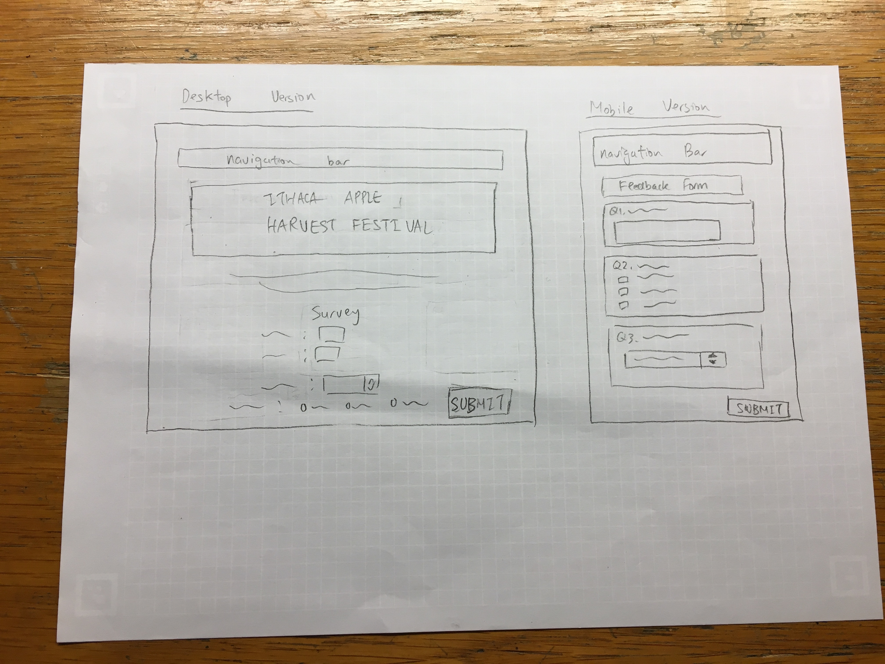
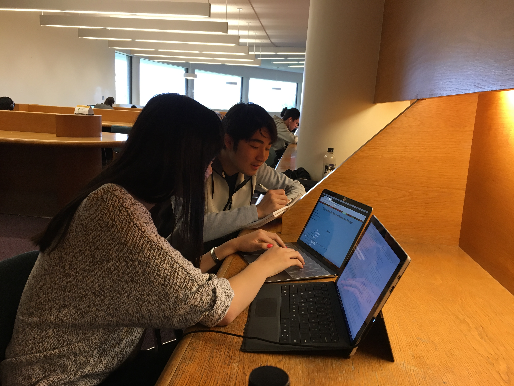
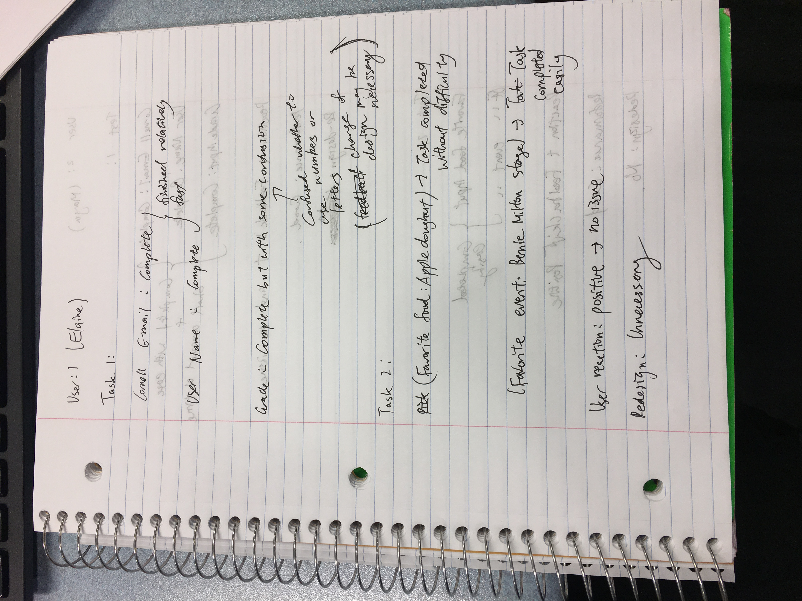
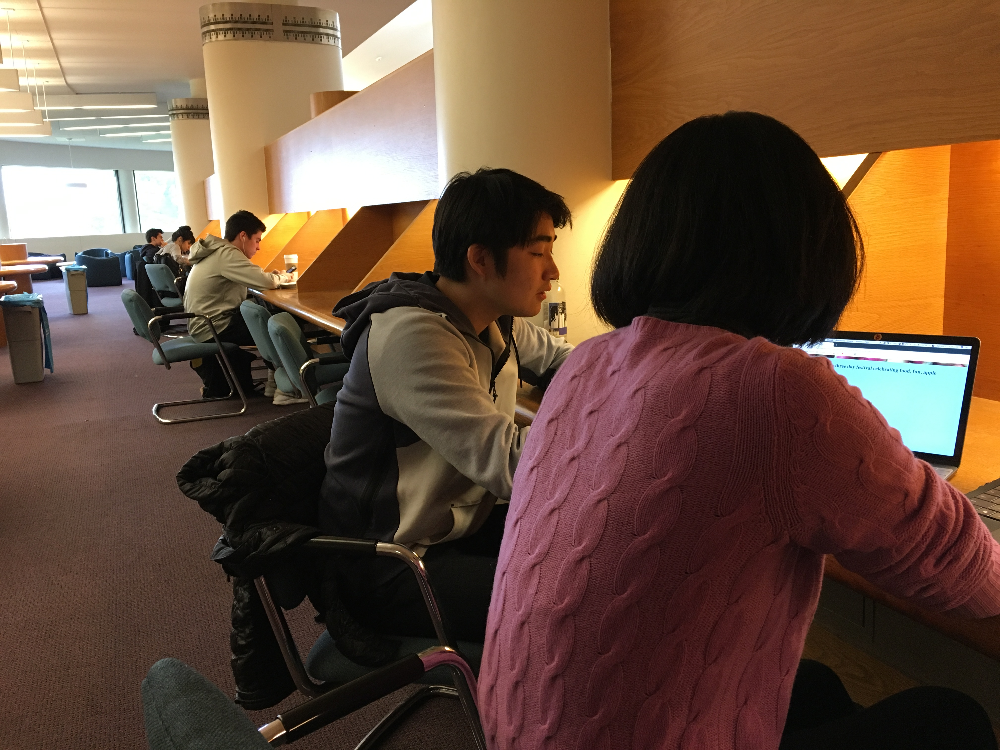
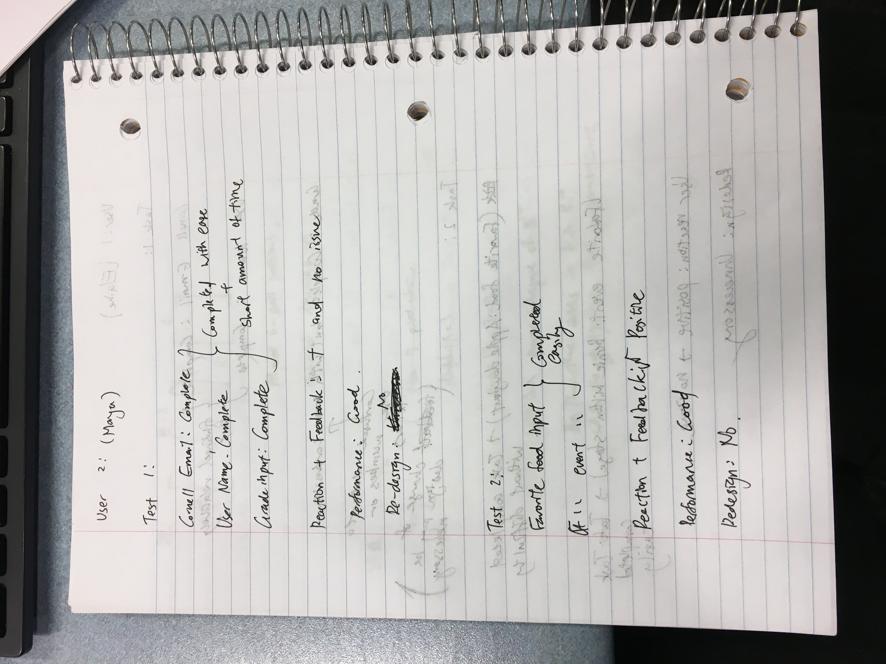

# Project 3 - Design Journey

**For each milestone, complete only the sections that are labeled with that milestone.**

Be clear and concise in your writing. Bullets points are acceptable.

## Milestone 1

## Target Audience (Milestone 1)

[Who is your site's target audience? This should be the original target audience from Project 1 or Project 2.]

My target audience are visitors from Cornell University. The target audience will be students, mainly freshman and sophomore, who have never visited the Apple Festival before. They are students who have heard about the event but never participated. I have chosen such target audience because there is a higher chance that the students have not visited the Apple Harvest Festival before.

## Planning & Designing User Input (Milestone 1)

[Determine what purpose the form for your site will accomplish, where it will go (physical placement on page and the HTML file name), and what form elements you plan on using.]

The purpose of the form will be to determine how useful my website was for my target audience, and gain information from the audience to add information to my website. The information can range from a poll of which food or event the target audience enjoyed the most to a feedback form which asks improvements for the festival. The purpose is appropriate for the target audience because the website exist to provide useful and accurate information to my target audience. Collecting relevant information for my target audience will enhance the quality of my website.

The form will be created on the index.html page. The reason behind such change was because I believed it would be easier for the use to find the form. Since there are not a lot of content on the index page, the user's concentration should be focused on the form.

For my form, I plan to include form elements such as text input, multiple choice inputs and submit buttons. I decided to include all three because having different types of form control can allow us to ask different types of questions for the users.

[Include sketches on your form below. Include sketches of your mobile and desktop versions. Image must show in Atom's Markdown Preview, otherwise 0 points for sketch. (Remember your relative URL should be case sensitive.)]

[What submission method will your form use? GET or POST. Explain your reasoning.]

I will use the POST submission method for the form. The reason behind this is because although I will no include any questions that require to input sensitive information except for e-mail address, I wanted to avoid the information being accumulated on the URL of the website. The information may not be sensitive, but having a shorter URL may be more useful.

## Determine the Form Validation Criteria (Milestone 1)

[For each control in your form, specify the validation criteria and your reasoning behind the criteria.]

Age
* Control (input type = "value")
* Required input
* Required control constraints: size = "1" or size = "2" or size = "3" and no letters
* Must include proper age to collect information for the website.

Grade
* Control (input type = "drop down list box")
* Optional input
* Required control constraint: only letters.
* To collect data for who is visiting my website.

email address
* Control (input type="email")
* Required input
* Required control constraints: must be validated email address. Use e-mail attribute for forms.
* Must include email-address to send messages or any other types of information

Favorite food
* Control (input type="select")
* Required input
* Required control constraints: Must pick one
* Must pick one to allow us to collect information and refine the content of the website.

Favorite Event
* Control (input type="radio button")
* Required
* Required control constraints: Must pick one
* Encouraged to pick one to allow us to collect information and refine the content of the website.

Improvements
* Control (input type = text area)
* Optional
* Less than 600 characters
* The time to send the form may be too long if the comment is very long.

## Design Form Feedback (Milestone 1)

[Include sketches of your mobile and desktop feedback.]

##  Plan Validation Pseudocode (Milestone 1)

[Write your form validation pseudocode here.]

**Age**

(Only applies when there is some type of input)

When the user tries to submit the form:
  if length of age is than 110 and includes letters:
    return error message "Please enter valid age number" and do not send form
  else:
    show no error message and submit form

**Grade**

(Only applies when there is some type of input)

When the user tries to submit the form:
  if grade includes characters other than letter and number:
    return error message "Please enter valid grade. Only letters or number" and do not send form
  else:
    show no error message and submit form

**Email address**

When the user tries to submit the form:
  if email is not valid:
    return error message "Please enter a valid Email address" and do not send form
  else:
    show no error message and submit form

**Favorite Food**

When the user tries to submit the form:
  if checkbox is not picked:
    return error message "Please pick one of the checkbox" and do not send form
  else:
    show no error message and submit form

**Favorite Event**

When the user tries to submit the form:
  if radio button is not picked:
    return error message "Please choose one option" and do not send form
  else:
    show no error message and submit form

**Improvement**

When the user tries to submit the form:
  if character exceeds 600:
    return error message "Please limit your response to 600 characters" and do not send form
  else:
    show no error message and submit form

## Additional Information (Milestone 1)

[(optional) Include any additional information, justifications, or comments we should be aware of.]

## Final Submission

### Task Planning (Final Submission)

[Plan out your one task for the Final Submission here before doing your user testing.]

The first task is to fill out the boxes/input of the surveys with values that I have specified. The value are the user's Cornell email address, name of the Users, and the grade which is the user is. The purpose of this task is to see whether the user can follow the basic instruction easily for the form. This will provide me with information if the survey is confusing. 

### Participant 1 (Final Submission)

1. Who is your participant, e.g., what is their name, where do they comes from, what is their job, characteristics, etc.?

The first participant's name is Elaine and is a student from the College of Art & Science at Cornell University. Elaine comes from China, Shanghai and has lived there for the past few years. She has never visited the Apple Harvest Festival before and, therefore, wants some type of information before visiting the festival.

2. Does your participant belong to your target audience of the site? (Yes / No)

Yes

[If “No”, what’s your strategy of associating the user test results to your target audience’s needs and wants? How can your re-design choices based on the user tests make a better fit for the target audience?]

### User Testing for Participant 1 (Final Submission)
[Report the results for your user's performance on each of your tasks. You should **describe the task** you ask the user to complete, explain **what the user did**, describe the user's **reaction/feedback** to the design, **reflect on the user's performance**, determine what **re-design choices** you will make. You can also add any additional comments in the **memo** field.]

Format:
- Task #1
  - **Task Description** (What was the task for this user?)
    - Fill out the survey using the email user's Cornell email address, name as user's Name, and grade as user's grade in letter.
  - **How did the user do? Did that meet your expectation?**
    - The user was able to complete the task for the email address and name part without problem.
    - The user was a bit confused as in the last task to input the user's grade in letters.
  - **User’s reaction / feedback to the design** (e.g., specific problems or issues found in the tasks)
    - The user's reaction was mostly good for the first two tasks but stated that the last task was a bit confusing.
  - **Your reflections about the user’s performance to the task**
    - The user performed overall well, and was what I had expected.
  - **Re-design choices**
    - The user's reaction encourage possible design changes to include more clarification for the last task.
  - **Memo** (Justify your decisions; additional notes.)
    - N/A

- Task #2
  - **Task Description** (What was the task for this user?)
    - Submit the form indicating that the favorite food was apple doughnut and favorite event was Bernie Milton Stage
  - **How did the user do? Did that meet your expectation?**
    - The user performed the task without any difficulty.
    - User's performance was similar to what I expected before conducting the test.
  - **User’s reaction / feedback to the design** (e.g., specific problems or issues found in the tasks)
    - The user did not encounter any issues with the task.
  - **Your reflections about the user’s performance to the task**
    - The user performed well and completed the task with ease.
  - **Re-design choices**
    - Redesign is unnecessary for the design choice.
  - **Memo** (Justify your decisions; additional notes.)
    - N/A

[Include evidence that you conducted user testing.]

### Participant 2 (Final Submission)

1. Who is your participant, e.g., what is their name, where do they comes from, what is their job, characteristics, etc.?

The second user's name is Maya. She is a student from the College of Engineering at Cornell University. She comes from Japan, but has lived in New York for the past few years. She has never visited the Apple Harvest Festival before.

2. Does your participant belong to your target audience of the site? (Yes / No)

Yes

[If “No”, what’s your strategy of associating the user test results to your target audience’s needs and wants? How can your re-design choices based on the user tests make a better fit for the target audience?]

### User Testing for Participant 2 (Final Submission)
[Report the results for your user's performance on each of your tasks. You should **describe the task** you ask the user to complete, explain **what the user did**, describe the user's **reaction/feedback** to the design, **reflect on the user's performance**, determine what **re-design choices** you will make. You can also add any additional comments in the **memo** field.]

Format:
- Task #1
  - **Task Description** (What was the task for this user?)
    - Fill out the survey using the email user's Cornell email address, name as user's Name, and grade as user's grade in letter.
  - **How did the user do? Did that meet your expectation?**
    - The user was able to perform all the tasks without major problem.
    - The user's performance was similar to what I expected.
  - **User’s reaction / feedback to the design** (e.g., specific problems or issues found in the tasks)
    - The user had overall a positive reaction to the form and the tasks.
  - **Your reflections about the user’s performance to the task**
    - The user's performed well.
  - **Re-design choices**
    - Redesigning seems unnecessary from the user's feedback.
  - **Memo** (Justify your decisions; additional notes.)
    - N/A

- Task #2
  - **Task Description** (What was the task for this user?)
    - Submit the form indicating that the favorite food was apple doughnut and favorite event was Bernie Milton Stage
  - **How did the user do? Did that meet your expectation?**
    - The user was able to complete the task with relative ease.
    - The user's performance did meet my expectation.
  - **User’s reaction / feedback to the design** (e.g., specific problems or issues found in the tasks)
    - The user did not encounter any issue/problems when conducting the user testing.
  - **Your reflections about the user’s performance to the task**
    - The user performed well because she was able to conduct the task with ease.
  - **Re-design choices**
    - Redesigning is unnecessary from the feedback received.
  - **Memo** (Justify your decisions; additional notes.)
    - N/A

[Include evidence that you conducted user testing.]

### Additional Users...

[If you conduct more user tests of your website, include your tests here. You are not *required* to conduct these additional tests, but you might find them helpful for refining your website.]

### Additional Design Justifications (Final Submission)

[If you feel like you haven’t fully explained your design choices in the final submission, or you want to explain some functions in your site (e.g., if you feel like you make a special design choice which might not meet the final requirement), you can use the additional design justifications to justify your design choices. Remember, this is place for you to justify your design choices which you haven’t covered in the design journey. Use it wisely. However, you don’t need to fill out this section if you think all design choices have been well explained in the final submission design journey.]
